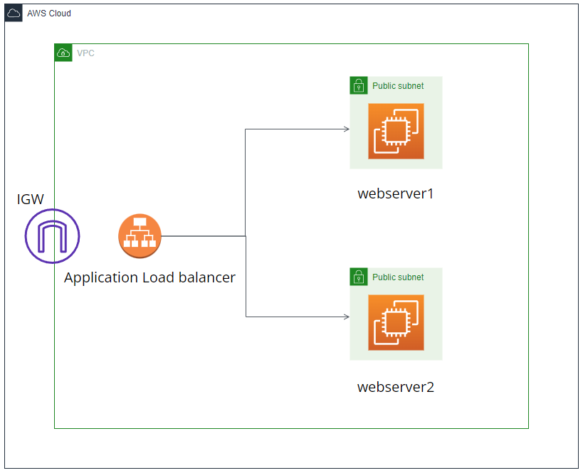
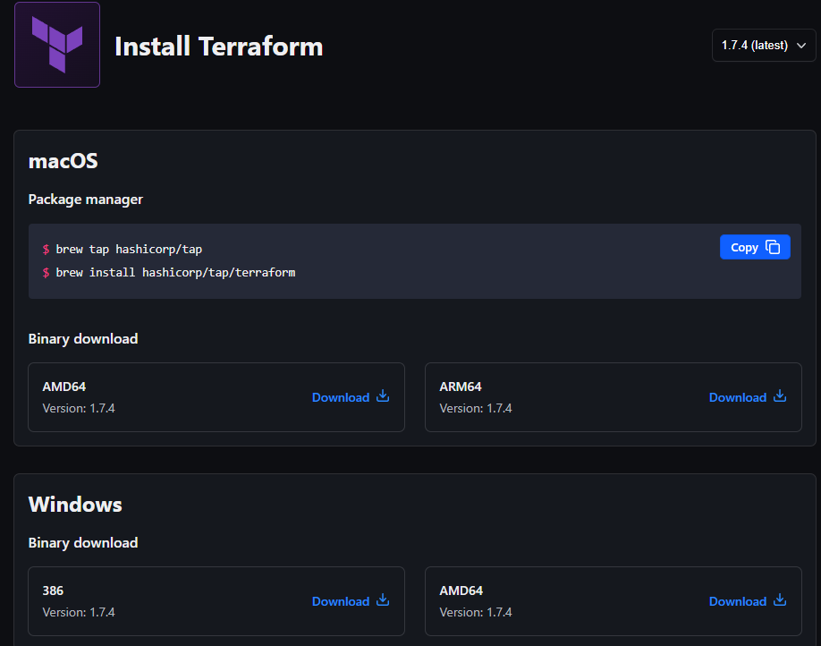
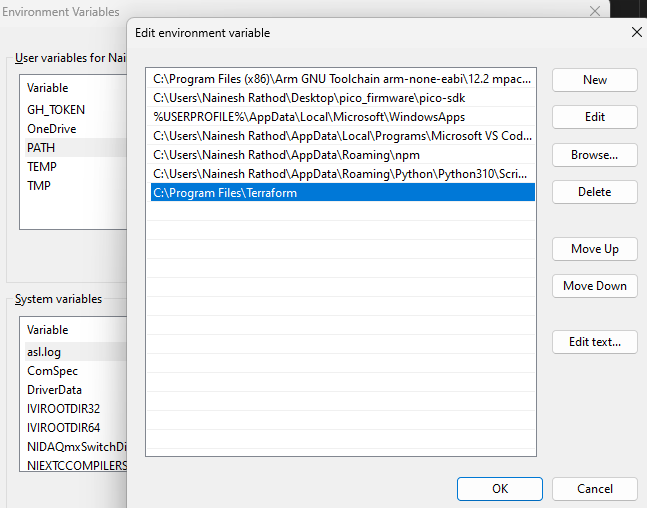
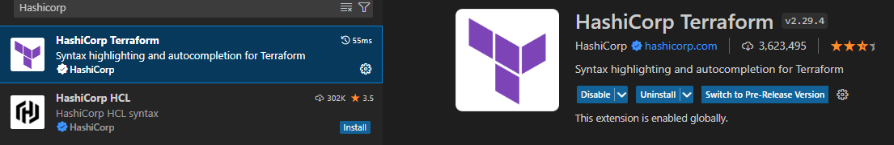
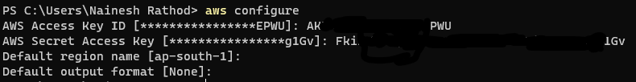
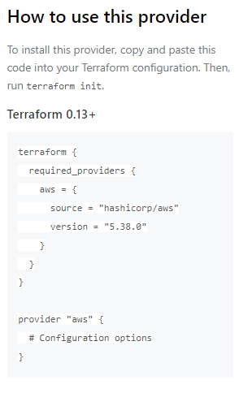

# Website hosting using Terraform - AWS project

### Aim: 
#### * To host a static website in AWS infrastructure using Terraform. 

### What you will accomplish : 
* Install and configure Terraform in Windows.
* Setup AWS access configuration on your Windows system.
* Set Terraform provider as AWS.
* Build a website using Terraform.

### Services used : 
1. Terraform
2. AWS EC2
3. AWS VPC

### Architecture : 




## Steps : 

### 1. Install Terraform.

* Go to the official website of Terraform provided by Hashicorp.  
https://developer.hashicorp.com/terraform/install  

* Navigate and download 386 file for Windows,

* A zipped folder will start downloading. Extract the exe file to Local disk C >> program files >> Terraform (create a folder to keep files organized) and paste.
*  Create an environment variable path accordingly to access Terraform easily in any terminal


Now Terraform is installed. Let's install the Hashicorp Terraform extension in vscode.

* Open vscode and in the extensions section search for Hashicorp Terraform and  install it.  



* This helps us in syntax highlighting and autocompletion for Terraform.

Now Terraform is installed and configured successfully.


### 2. Configure the system for AWS access.
#### Note: make sure you have AWS CLI already installed in your system.
* In your AWS account go to Security credentials and create an access key. We will use this key to grant permissions for our  system to utilize AWS resources.
* Open a new Powershell terminal and run this command :
```bash
aws configure
```
* Enter your Access key and Secret access key and set your region accordingly.  
 


### 3. Set Terraform provider.
* Go to this website and search for providers. 
https://registry.terraform.io/providers/hashicorp/aws/latest  


* Click on use provider. It will show us a code.  

* Save this code in a separate provider.tf file.
* Run this command to initialize Terraform in your directory.
```bash
terraform init
```
### 4. Building website 
* In this project we are creating a new separate VPC with 2 Public subnets, a route table, and an Internet Gateway.
* A security group will be created for our VPC. In this group, both subnets will have an ingress rule with cidr-block as [0.0.0.0/0] and ports as 22 and 80 to allow inbound traffic.
* An egress rule will be created to allow our website to serve our external traffic with cidr-block as [0.0.00.0/0] and ports= -1 (Allowing all ports).
* Two EC2 instances(webservers) will be running our website . These instances will be deployed in our public subnets which we created earlier.
* A load balancer will be provisioned to manage requests on our website.

#### * Complete code is available in the main.tf file.  
#### * Two bash scripts will be available to setup our website on our EC2 instances.


### 5. Terraform commands

* To validate your Terraform code use : 
```
terraform validate
```
* Plan your deployment using : 
```
terraform plan
```
* Apply changes and start deployment using :
```
terraform apply
```

## Congratulations!
### You have successfully hosted a website using Terraform.
